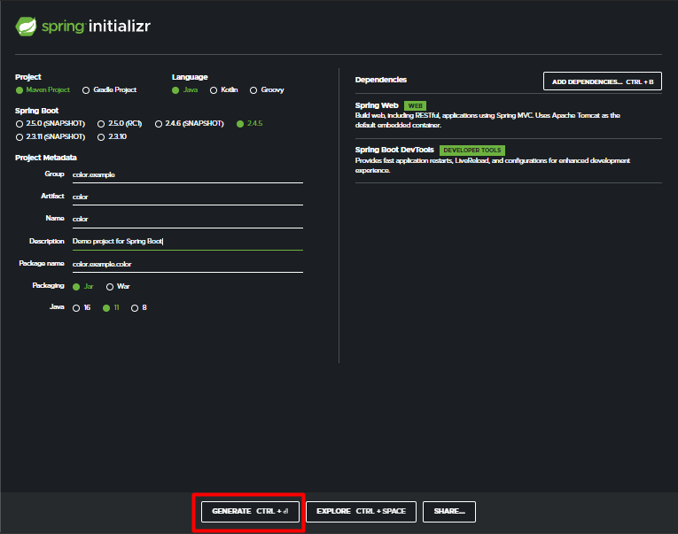
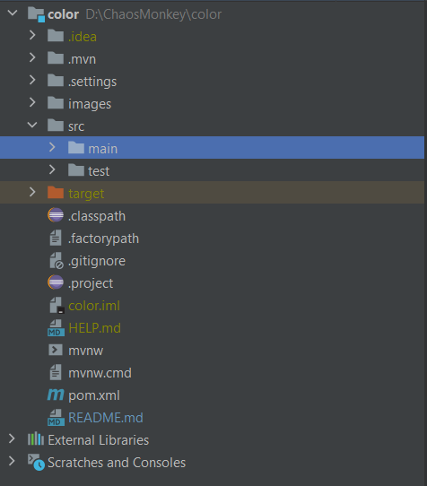
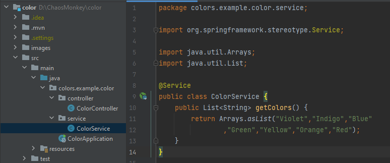
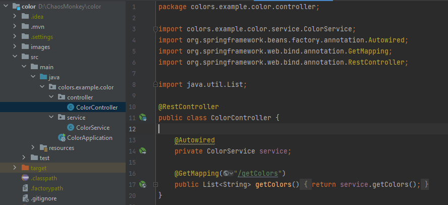
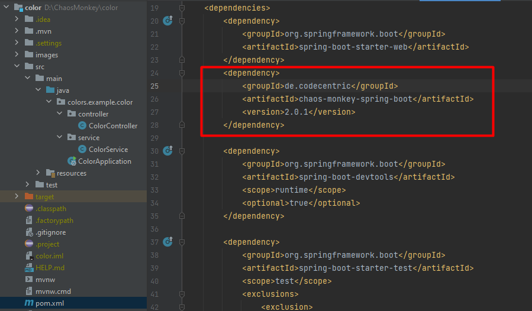
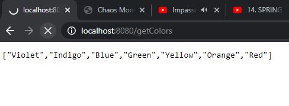
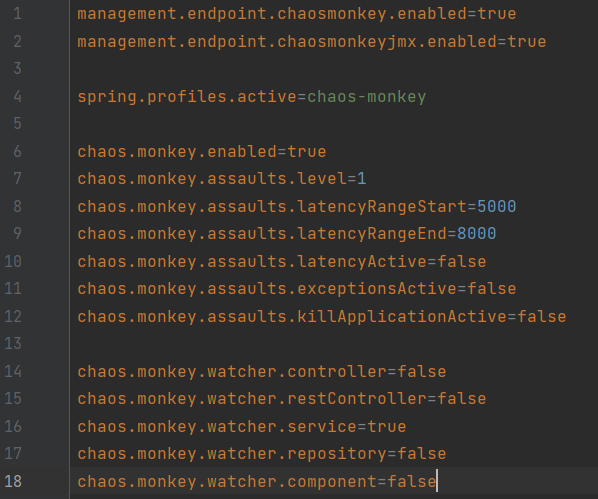

# Pequeno tutorial sobre Chaos Monkey :monkey: com Spring Boot 
### Para iniciar o projeto vamos utilizar o [Spring Initializer](https://start.spring.io/)

#### Utilize as dependências Spring Web/DevTools



-----

### Após clicar em GENERATE, abra o projeto com seu editor de texto, em meu caso utilizarei o [Intellij IDEA](https://www.jetbrains.com/pt-br/idea/), nossa hierarquia de pastas ficou da seguinte forma:



### Agora teremos que criar um Service e um Controller:

##### [Service](https://github.com/Matheus-Reinert/chaos_monkey/blob/master/src/main/java/colors/example/color/service/ColorService.java)

##### [Controller](https://github.com/Matheus-Reinert/chaos_monkey/blob/master/src/main/java/colors/example/color/controller/ColorController.java)


#### Obs: [ColorApplication](https://github.com/Matheus-Reinert/chaos_monkey/blob/master/src/main/java/colors/example/color/ColorApplication.java) Não possui alteração.
------

### Criando o CHAOS ao nosso projetinho
#### Dentro de [pom.xml](https://github.com/Matheus-Reinert/chaos_monkey/blob/master/src/main/java/colors/example/color/ColorApplication.java) Adicione a dependência do chaos monkey



```java
<dependency>
	<groupId>de.codecentric</groupId>
	<artifactId>chaos-monkey-spring-boot</artifactId>
	<version>2.0.1</version>
</dependency>
```
----




