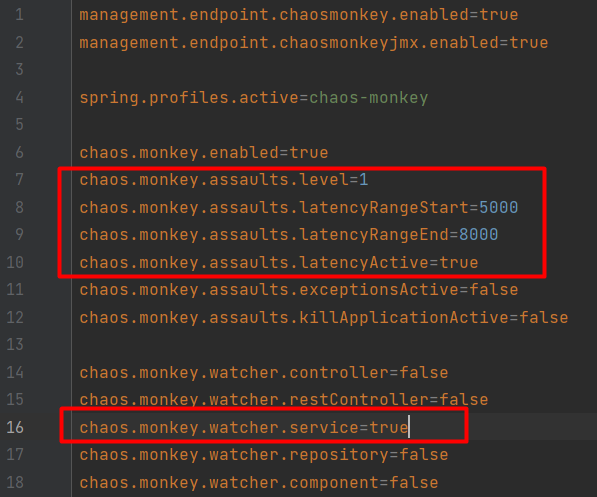
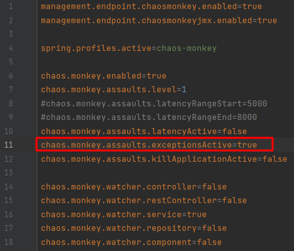
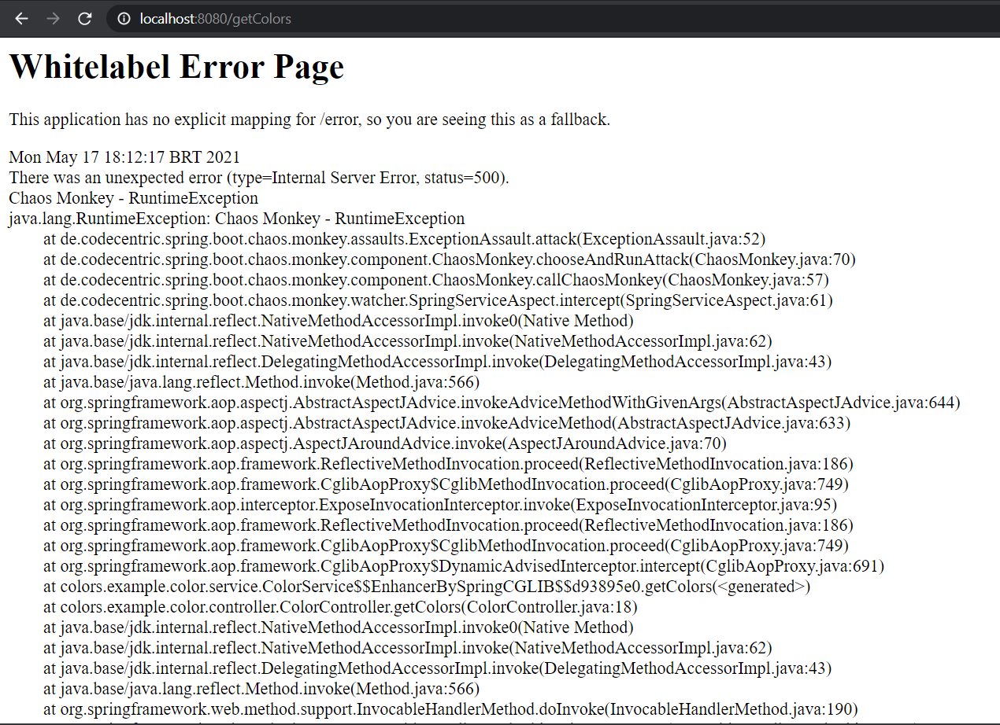
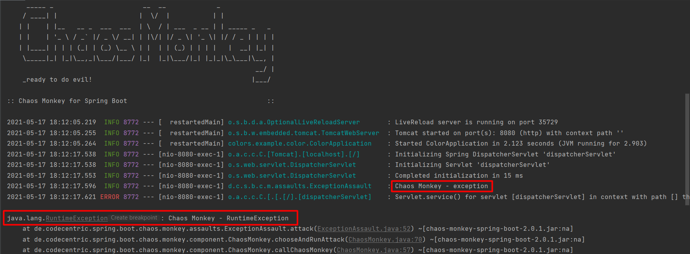
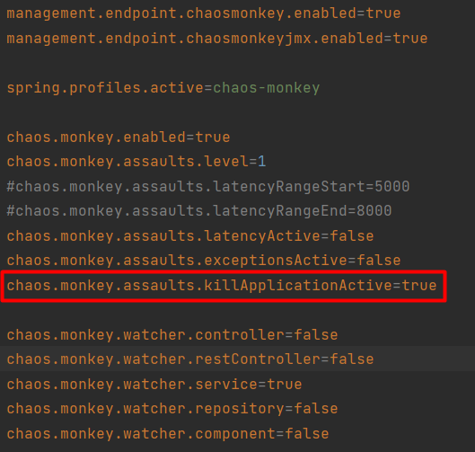
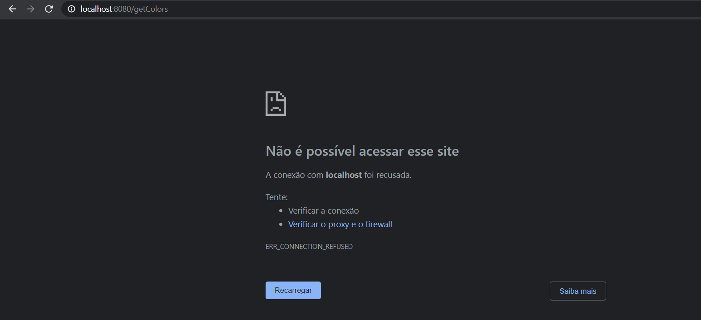
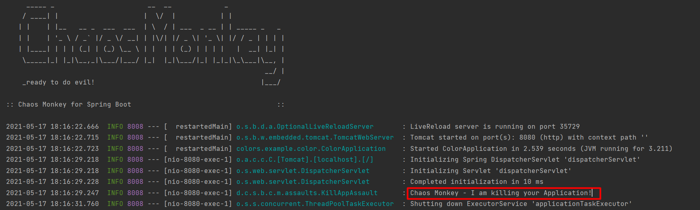

# Pequeno tutorial sobre Chaos Monkey :monkey: com Spring Boot 

### No Chaos monkey estão watchers e Assalts:
- Watchers: Um observador é um componente Chaos Monkey para Spring Boot, que fará a varredura em seu aplicativo em busca de um tipo específico de anotação.
- Assaults: Os assaltos são o coração do Monkey's Chaos e ele os utiliza com base na sua configuração. Em nosso projeto utilizaremos latency, kill e exception.
### Para iniciar o projeto vamos utilizar o [Spring Initializer](https://start.spring.io/)

#### Utilize as dependências Spring Web/DevTools


-----

### Após clicar em GENERATE, abra o projeto com seu editor de texto, em meu caso utilizarei o [Intellij IDEA](https://www.jetbrains.com/pt-br/idea/), nossa hierarquia de pastas ficou da seguinte forma:


### Agora teremos que criar um Service e um Controller:

##### [Service](https://github.com/Matheus-Reinert/chaos_monkey/blob/master/src/main/java/colors/example/color/service/ColorService.java)

##### [Controller](https://github.com/Matheus-Reinert/chaos_monkey/blob/master/src/main/java/colors/example/color/controller/ColorController.java)


#### Obs: [ColorApplication](https://github.com/Matheus-Reinert/chaos_monkey/blob/master/src/main/java/colors/example/color/ColorApplication.java) Não possui alteração.
------

### Criando o CHAOS ao nosso projetinho
#### Dentro de [pom.xml](https://github.com/Matheus-Reinert/chaos_monkey/blob/master/src/main/java/colors/example/color/ColorApplication.java) Adicione a dependência do chaos monkey


```java
<dependency>
	<groupId>de.codecentric</groupId>
	<artifactId>chaos-monkey-spring-boot</artifactId>
	<version>2.0.1</version>
</dependency>
```
----
### Agora é só adicionar as configurações dentro do [application.properties](https://github.com/Matheus-Reinert/chaos_monkey/blob/master/src/main/resources/application.properties)


```java
management.endpoint.chaosmonkey.enabled=true
management.endpoint.chaosmonkeyjmx.enabled=true

spring.profiles.active=chaos-monkey

chaos.monkey.enabled=true
chaos.monkey.assaults.level=1
#chaos.monkey.assaults.latencyRangeStart=5000
#chaos.monkey.assaults.latencyRangeEnd=8000
chaos.monkey.assaults.latencyActive=false
chaos.monkey.assaults.exceptionsActive=false
chaos.monkey.assaults.killApplicationActive=false 

chaos.monkey.watcher.controller=false
chaos.monkey.watcher.restController=false
chaos.monkey.watcher.service=true
chaos.monkey.watcher.repository=false
chaos.monkey.watcher.component=false
```

----
### Com o Chaos ainda desligado a tela esperada de nosso projeto traz apenas algumas cores 


----
# Dando inicio aos nossos testes com o Chaos, ativando a latência:
- Este tipo de agressão acrescenta um atraso aleatório às solicitações processadas pelo aplicativo na faixa determinada pelas propriedades *chaos.monkey.assaults.latencyRangeStart* e *chaos.monkey.assaults.latencyRangeEnd*. O número de solicitações atacadas depende da propriedade *chaos.monkey.assaults.level*, em que 1 significa cada solicitação e 10 significa cada 10ª solicitação.



### Uma pequena diferença já pode ser notada ao subir a aplicação novamente, nossa página leva algum tempo para carregar.


-------

# Em nosso segundo experimento vamos lançar uma exceção e ver como nosso sistema se comporta.




-----

# No 3° experimento o Chaos monkey mata nossa aplicação








